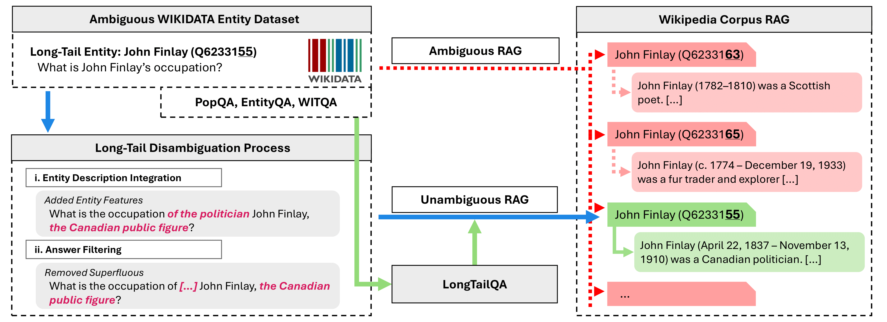

# LongTailQA: Benchmarking LLMs and RAG Models on Disambiguated Long-Tail Entities

[](https://lrec2026.info/)
[](https://huggingface.co/datasets/williamx854/LongTailQA)
[](https://opensource.org/licenses/MIT)

> **Official repository and dataset for the LREC 2026 paper: "LongTailQA: Benchmarking LLMs and RAG Models on Disambiguated Long-Tail Entities"**

Large Language Models (LLMs) struggle with memorizing long-tail facts, and while Retrieval-Augmented Generation (RAG) helps, current evaluation benchmarks (like PopQA and EntityQA) suffer from widespread **entity ambiguity**.

**LongTailQA** is a rigorously disambiguated benchmark containing ~6.5k questions designed to provide a clean, reliable evaluation of LLM and RAG performance on long-tail entities by using Wikidata knowledge graph enrichments.


*Overview of the disambiguation and LongTailQA construction process.*

---

## 🚀 Quickstart: Loading the Dataset

The easiest way to use the LongTailQA benchmark is via the Hugging Face `datasets` library:

```python
from datasets import load_dataset

# Load the entire benchmark
dataset = load_dataset("williamx854/LongTailQA")

# Or load a specific subset
popqa_subset = load_dataset("williamx854/LongTailQA", "PopQA")
```

---

## 📂 Repository Structure

### 1. Disambiguated Datasets (`/Datasets`)

Contains the final disambiguated long-tail question-answering datasets in CSV format. Columns include `disambiguated_question`, `answers`, `subject_entity_id`, `object_entity_id`, `relation_type`, and `relation_id`.

- **`DisambPopQA.csv`**: Derived from PopQA.
- **`DisambEntityQA.csv`**: Derived from EntityQA.
- **`DisambWITQA.csv`**: Derived from WITQA.

### 2. Disambiguation Prompts (`/Prompts`)

Contains the exact few-shot prompts provided to GPT-4o for the query-refinement and answer-filtering steps of our entity disambiguation process (Section 3.2.2 of the paper).

- **`disambiguation_prompt.txt`**: Injects Wikidata descriptions to disambiguate queries.
- **`filtering_prompt.txt`**: Final filtering step to remove potentially answer-revealing information.

### 3. Data Processing Code (`/Code`)

Python scripts used for dataset construction and preprocessing:

- **`entity_linking.py`**: Identifies and maps entity mentions in EntityQA to corresponding Wikidata IDs.
- **`extract_pageviews.py`**: Queries the Wikidata API to calculate average monthly Wikipedia page views (2023) for entities, establishing our popularity metric.
- **`scrape_gold_docs.py`**: Retrieves Wikipedia article URLs via Wikidata and scrapes full text content for the "Gold Only" ($k=1$) retrieval experiments.

---

## ⚙️ RAG Model Evaluation

To reproduce our evaluation results, we adapted the official implementations of the tested RAG models. You can find their original repositories here:

- **Self-RAG**: [AkariAsai/self-rag](https://github.com/AkariAsai/self-rag)
- **InstructRAG**: [uf-hobi-informatics-lab/InstructRAG](https://github.com/uf-hobi-informatics-lab/InstructRAG)

Our specific inference scripts for running these models on the LongTailQA benchmark can be found in the `/Evaluation` folder.

---

## 📝 Citation

If you use LongTailQA, please cite our LREC 2026 paper:

```bibtex
@inproceedings{xion2026longtailqa,
  title={LongTailQA: Benchmarking LLMs and RAG Models on Disambiguated Long-Tail Entities},
  author={Xion, William and Hadler, Uwe and Cofala, Tim and Idahl, Maximilian and Roy, Soumyadeep and Nejdl, Wolfgang},
  booktitle={Proceedings of the 2026 Joint International Conference on Computational Linguistics, Language Resources and Evaluation (LREC-COLING 2026)},
  year={2026},
  address={Palma de Mallorca, Spain},
  publisher={ELRA}
}
```

